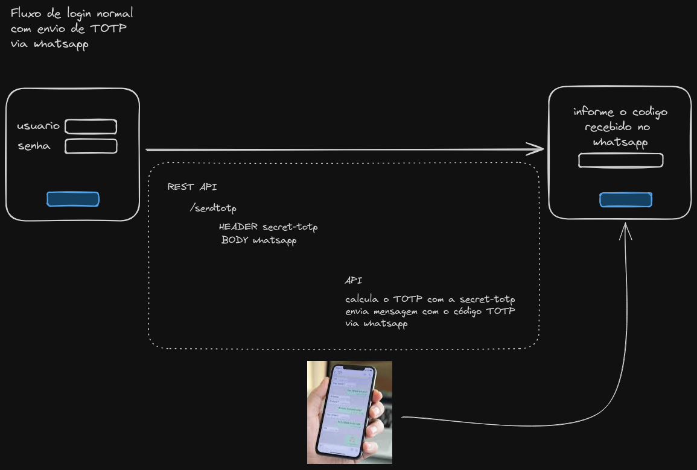
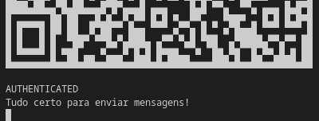
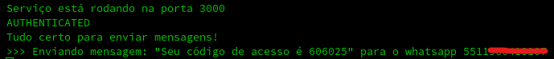

# Whatsapp API - send TOTP token thru whatsapp

Este é um repositório de exemplo de como você pode enviar um código TOTP via whatsapp, sem a necessidade de um aplicativo autenticador nem api de terceiros.

Para uso em larga escala é aconselhado o uso de API's mais robustas como Twilio ou a própria API do Whatsapp Empresas.

O Código TOTP é gerado com base em uma secret combinada entre as partes, ela é a base para a geração dos tokens TOTP.



## Pré-reqs

- node
- npm

```
npm install whatsapp-web.js
npm install qrcode-terminal
npm install open
npm install speakeasy
npm install cors
```

## Rodar o serviço

```
node service.js
```

## Configurar o Whatsapp Web para envio das mensagens


Logo após ler o QRCode no aparelho que enviará as mensagens, aguarde até a mensagem Autenticated!



Um Cache é gerado e caso ele exista na próxima execução, nenhum QRCode será solicitado e o serviço vai tentar autenticar com o cache caso não tenha expirado.


Por motivos óbvios essas pastas não devem ser compartilhadas.

## Envio de mensagens

Para enviar as mensagens basta um POST na URI:
```
http://localhost:3000/sendTOTP
```

Passando o Header:
```
--header 'totpsecret: <secret-totp>'
```
Onde <secret-totp> é a secret para geração do token TOTP

Passando o Body:
```json 
{ "number": "551199999999" }
```

curl completo do exemplo:
```shell
curl --request POST \
  --url http://localhost:3000/sendTOTP \
  --header 'Content-Type: application/json' \
  --header 'totpsecret: <secret>' \
  --data ' { 
	 "number" : "551199999999" 
 }'
```

Na Api será exibido o log:




Este é apenas um exemplo, por isso essa API não tem autenticação, não tem tratamento de erro, etc... ela foi feita apenas para fins didáticos.


## Referências:
- https://www.dio.me/articles/criar-um-bot-whatsapp-com-nodejs
- https://wwebjs.dev
